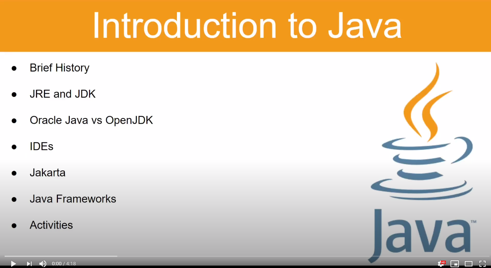

# Unit 1 Lesson 1 - Introduction to Java

[Lesson Slides](https://docs.google.com/presentation/d/1IbkN3dbFgc648J2UZrndsTJGw5b8IO7TNh0P1v-_pPA/edit?usp=sharing)

---
## History of Java

- Java was originally named Greentalk. It was created by James Gosling and his team, Green Team, in 1991 at Sun Microsystems.
- Greentalk was then changed to Oak and finally Java in 1995.
- In 2006 Java was made open sourced by Sun Microsystems.
- In 2010 Oracle purchased Sun Microsystems. Oracle split Java and named the open sourced version OpenJDK, and their own as OracleJDK.

### Helpful Links

to read

- [Java History - javatpoint](https://www.javatpoint.com/history-of-java)
- [Java History - geeksforgeeks](https://www.geeksforgeeks.org/the-complete-history-of-java-programming-language/)
- [Java - wiki](https://en.wikipedia.org/wiki/Java_(programming_language))

to watch

- [Java History - Simplilearn](https://www.youtube.com/watch?v=i6AZdFxTK9I)
- [Java History - SyntaxByte](https://www.youtube.com/watch?v=eX7VnkcXMdM)
- [James Gosling History - Computer History Museum](https://www.youtube.com/watch?v=TJ6XHroNewc)

---
## JRE and JDK

- The Java Runtime Environment or [JRE](https://github.com/Kevin-Lago/Java-Course-Guide/tree/unit1/unit_1_getting_started/#JRE) basically runs Java programs.
- The Java Development Kit or JDK is essentially a set of tools to create Java applications.

### Helpful Links

to read

- [JDK, JRE and JVM - guru99](https://www.guru99.com/difference-between-jdk-jre-jvm.html#:~:text=JDK%20and%20JRE.-,KEY%20DIFFERENCES,an%20environment%20for%20executing%20bytecode.&text=JDK%20is%20platform%20dependent%2C%20JRE,for%20developing%2C%20debugging%2C%20etc.)
- [JDK - wiki](https://en.wikipedia.org/wiki/Java_Development_Kit)
- [JVM - wiki](https://en.wikipedia.org/wiki/Java_virtual_machine)

to watch

- [JDK, JRE, JVM - The Learn Programming Channel](https://www.youtube.com/watch?v=BXFHuaQNnLo)
- [JVM vs JRE vs JDK - Smartherd](https://www.youtube.com/watch?v=RYd_hagCiVk)

---
## Oracle Java vs OpenJDK

- The main difference between Oracle Java and OpenJDK is licensing. 
- Oracle Java is commercially supported, released and distributed by Oracle.
- Oracle Java has an OTN (Oracle Technology Network) License.
- OpenJDK is community supported and has a GPL. (General Public License)

### Helpful Links

to read

- [Oracle Technology Network License](https://www.oracle.com/downloads/licenses/standard-license.html)
- [Oracle JDK vs OpenJDK - javapapers](https://javapapers.com/java/oracle-jdk-vs-openjdk-and-java-jdk-development-process/)
- [Oracle Licensing FAQs](https://www.oracle.com/technetwork/java/javase/overview/oracle-jdk-faqs.html)

to watch

- [Which JDK should you install? - The Learn Programming Channel](https://www.youtube.com/watch?v=wv6N2suE_nQ)

---
## IDEs

- Where the magic happens.
- Integrated Development Environments or IDEs are basically a super text editor.
- IDEs have features and tools that makes creating software easier.
- There're several IDEs you could use.
- I recommend [IntelliJ](https://www.jetbrains.com/idea/) to start.

### Helpful Links

other IDEs

- [Eclipse](https://www.eclipse.org/downloads/)
- [NetBeans](https://netbeans.org/)
- [BlueJ](https://bluej.org/)
- [JDeveloper](https://www.oracle.com/application-development/technologies/jdeveloper.html)

to read

- [Choosing your Java IDE - Martin Heller](https://www.infoworld.com/article/3114167/choosing-your-java-ide.html)

to watch

- [Best IDE for Different Languages - Rimor Studio](https://www.youtube.com/watch?v=ana1mFFMHIk)

---
## Jakarta

- Jakarta is an Enterprise Edition of Java.
- Older versions are called JavaEE, and the oldest J2EE.
- The EE versions of Java provide tools to create enterprise level applications.

### Helpful Links

to read

- [About Jakarta](https://jakarta.ee/about/)

to watch

- [Java EE - The Learn Programming Channel](https://www.youtube.com/watch?v=jmLfIZw2WWY&t=29s)
- [Jakarta EE - IBM](https://www.youtube.com/watch?v=bFNczrl4OMM)

---
## Java Frameworks

- Java Frameworks provide more tools to create applications
- Some examples include:
	- Spring
	- RabbitMQ
	- Mockito
	- JUnit
	- Thymeleaf

### Helpful Links

to read

- [What is a Java Framework? - Red Hat](https://www.redhat.com/en/topics/cloud-native-apps/what-is-a-Java-framework)
- [List of Java Frameworks - Wiki](https://en.wikipedia.org/wiki/List_of_Java_frameworks)

to watch

- [What is the difference between frameworks and libraries? - Java Brains](https://www.youtube.com/watch?v=PjyVXs0_3H8)

---
## Activities

- Install IntelliJ.
- Install JDK.
- Create and Run a "Hello, World!" program.

### Helpful Links

to read

- [IntelliJ Install Guide](https://www.jetbrains.com/help/idea/installation-guide.html#standalone)
- [JDK Install Guide](https://docs.oracle.com/en/java/javase/11/install/overview-jdk-installation.html#GUID-8677A77F-231A-40F7-98B9-1FD0B48C346A)
- [First Hello, World! - GeeksforGeeks](https://www.geeksforgeeks.org/beginning-java-programming-with-hello-world-example/)

to watch

- [First Java App with IntelliJ](https://www.youtube.com/watch?v=H_XxH66lm3U)

---

[Lesson Quiz](https://docs.google.com/forms/d/1xv316sTfA12PUxXmN3K5oGkq3kesilNqRxaL3psGlec/viewform?edit_requested=true)

[Next Lesson](https://github.com/Kevin-Lago/Java-Course-Guide/tree/master/unit_1_getting_started/lesson_2_statements_expressions_datatypes_and_variables)

# Java Course Guide

